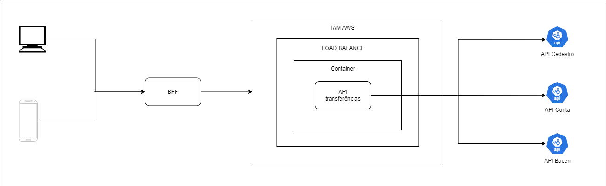

<!-- PROJECT LOGO -->
 

  

<h3 align="center"> Desafio engenharia de software - Itaú</h3>

  

    <a href="https://www.linkedin.com/in/luan-passos/">LinkedIn</a>
    ·
    <a href="http://localhost:8080/swagger-ui/index.html">Swagger</a>
  

### Sobre o Projeto
Esse projeto é inteiramente do Desafio do Itaú. Ela deve seguir as seguintes regras: 
- Validar se o cliente que vai receber a transferência existe passando o idCliente na API
   de Cadastro;
- Buscar dados da conta origem passando idConta na API de Contas;
- Validar se a conta corrente está ativa;
- Validar se o cliente tem saldo disponível na conta corrente para realizar a transferência;
- A API de contas retornará o limite diário do cliente, caso o valor seja zero ou menor do
   que o valor da transferência a ser realizada, a transferência não poderá ser realizada;
- Após a transferência é necessário notificar o BACEN de forma síncrona que a transação
   foi concluída com sucesso. A API do BACEN tem controle de rate limit e pode retornar
   429 em caso de chamadas que excedam o limite;
- Impedir que falhas momentâneas das dependências da aplicação impactem a
   experiência do cliente;

### Como Subir
- Subir o docker-compose que está na raiz do projeto (Mock das apis Conta, Cliente e Bacen)
- Subir a aplicação, está apontada na porta 8080. Link do swagger no top do README.

### Arquitetura

Essa api utiliza *coroutines* em todo o projeto para aumentar a performance. 
Opitei por utilizar o *flow* da coroutine para realizar o retry em caso de exceção na chamada do Bacen, 
esse retry irá tentar até conseguir realizar com sucesso a requisição

- *Documentação dos Endpoints:* A documentação está disponível no Swagger : <a href="http://localhost:8080/swagger-ui/index.html">Swagger</a>.
- *Diagrama da Arquitetura:*
 

### Tecnologias

- Java 17
- SpringBoot 3.x
- Coroutine 1.6.4
- Wiremock 3.x

### Testes Unitários

- *Cobertura*: Cobertura total de 80%